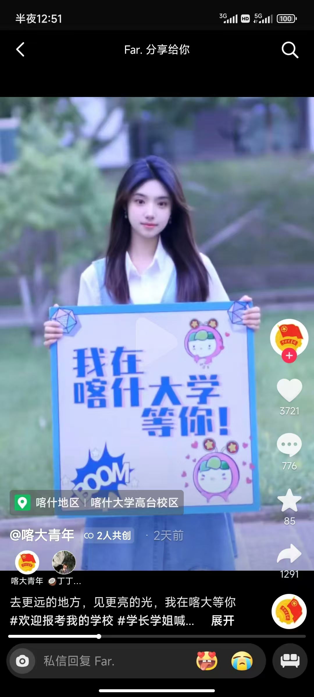

## 录取之时

我与喀大的缘分，说不清，也道不尽。高考出分后，我的成绩差不多在二本线附近，省内能选的学校不太合心意，便开始看省外的学校。当时浙江可以填 80 个志愿，我用夸克辅助筛选，前面不少志愿显示的录取概率都有 70%、80%，心里也觉得总能录上一个。填到最后，还剩五个位置，却不知道该选什么了。

这时，一位高中损友给我发来一张抖音截图：一位喀大学姐，左手拿着共青团中央的牌子，右手举着“我在喀大等你”。想着反正最后几个志愿也没什么主意，我便把喀大填在了倒数第二位。最后一个志愿填的是护理专业，当时还想，要是真去了，以后哥哥当医生，我当护士，也算能一起工作。80 个志愿里，我填的几乎都是电气相关专业，怎么也没想到，最终会被排在这么后面的喀大录取。

:::div{class="mx-auto max-w-72"}

:::

查预录取结果的那段时间，我至今还记得。我挨个打开学校官网，从第一个志愿查到七十多个，都没查到自己的名字。各校的查询系统又不一样，越查越慌。最后，还是那位损友帮我打了喀什大学招生办的电话，才确认了我的去向。

听到消息时，我很难接受。喀什对我而言太陌生，离家又远，机票动辄几千元，眼泪止不住地流。我开始犹豫要不要复读，哥哥则陪我重新评估了一遍：以我当时的情况，即使再读一年，也未必能考到远高于现有水平的学校。与其把希望全押在复读上，不如先去喀大，把大学四年用好，再争取去一所更合心意的学校读研。

这番话让我慢慢接受了录取结果。决定来喀大后，9 月还在家里时，我就报了学校的英语四级考试，也算是提前给自己的大学生活定下了一个小目标。

## 我的三年

### 大一学年：懵懂并努力

刚到喀什时，眼前灰扑扑的城市让我有些失落。加上来之前就想好了要继续读研，我心里一直暗暗较劲：既然已经来了，就好好学，给自己争取更多选择。

大一主要是在适应大学生活中把基础课学好。因为开学较晚，课表排得很满，我当时对高数尤其上心，甚至在大学语文课上也埋头做题。高数期中考试做得又快又顺，多少给了我一些信心。社团面试时，我提到自己高中学过 Python，也因此和一些学长有了联系。后来参加了全国大学生英语竞赛和机械设计创新大赛，开始接触课堂之外的事情。

这一年，我对电路等基础课程学得比较扎实，也陆续通过了英语四级、六级和计算机二级。四级是入学后第一次让我很在意的考试，考了 586 分；六级备考时有些松懈，最后考了 490 分左右，虽然通过了，但我还想继续刷分。计算机二级则是考前一周集中准备后通过的。学年结束时，我的绩点排在年级第一，也获得了国家奖学金。

### 大二学年：竞赛并巩固

大二几乎是被竞赛贯穿的一年。我一边继续学数学和专业课，通过计算机三级、四级，一边参加各种比赛，有收获，也走了不少弯路。

刚开学，我参加了外研社和跨文化能力等外语类比赛，拿到两个省级银奖。寒假第一次参加美赛，当时 DeepSeek 刚兴起，我用得还不熟练，也缺乏建模经验，最后拿了 S 奖。之后参加全国大学生职业规划大赛，去新疆大学比赛时冷得够呛，最终拿到优秀奖。那时我的专业成果还不多，准备的讲稿又经过 AI 润色，很多话不像自己平时会说的，上台前背得很吃力，讲起来也紧张。后来再参加大英赛，拿了二等奖，但没能从校赛继续晋级。

这一年投入最多、也最有收获的是中国机器人及人工智能大赛，我最终获得了国家一等奖。备赛时，经常熬夜看比赛回放、改代码，反复调整策略。5 月还经历了被误诊为水痘、在校医院隔离的插曲，那段经历至今回想起来仍让我觉得荒谬。期间也听过一些老师和竞争对手的冷嘲热讽，我憋着一口气，想把成绩做出来。

暑假留校，我又参加了西门子杯，做离散行业自动化方向的设计，设计了三部十层电梯。但那时我连 PLC 都没有系统学过，到了个人赛现场，甚至没能把 PLC 连上，实实在在吃了缺乏经验的亏。那段时间往返乌鲁木齐折腾了好些天，也参加了全国大学生电子设计竞赛。起初想做电源 A 题，后来考虑到自己的基础和完成的把握，改选了 C 题，不过投入不多。一直留校到 8 月，和对象过完生日后，我才回家。

也是在这一年，我做了一个改变大学生活的决定：去广东工业大学联合培养一学年。专业课会更难，喀大的一些比赛没法继续参加，奖学金评选也可能受影响，还要和对象分开一整年。这些都是我当时需要考虑的事。

但我还是想去。喀大的一些讲座和活动让我觉得繁琐，尤其是有些要求党员优先参加的安排，占用了不少时间，我却很难从中有所收获。我想换一个环境，接触更有挑战的课程，也给自己留出时间安心准备考研。

8 月，我和对象坐火车去阿克苏旅游，途中得知喀什大学有了保研名额。可那时，我已经按考研的方向做了打算，对保研的具体情况也不了解，第一反应仍是自己考研更踏实。

### 大三学年：联培并提高

大三，我独自来到广东工业大学，在新的环境里重新适应课程和学习节奏，也开始补上自己一直缺少的科研经历。

刚到广工时，我甚至不好意思说自己来自喀什大学，总觉得低人一等。身边不少同学基础扎实，自主学习能力也强，这让我感到了差距。专业课的难度和进度都带来了压力，电力电子、电力系统相关课程的修读任务在期中就要完成，想取得好成绩，就得花更多时间跟上。

10 月，我遇到了给我很多帮助的杨苓老师，开始跟着她学习、做科研。我完成了一项发明专利申请，目前已经公开；也参与了一篇期刊论文的撰写和返修。大三上学期的成绩还不错，寒假我继续推进科研和专利相关工作，同时开始接触 Codex、“小龙虾”等 AI 智能体，尝试用它们辅助编程和处理日常任务。

大三下学期刚开始，课程还不多，我便花时间研究 AI，做了一些小项目。后来课程渐渐多了，一年一度的足球机器人比赛也开始了。考虑到想带着对象一起参赛，我还是认真准备了一轮，但确实占用了很多时间和精力。有了 AI 的辅助，修改代码、调试开球策略等工作快了不少，我一个人也能承担起所有的技术任务。

5 月前后，我争取到了南网科研院的实习机会。起初，我对自己的学校背景能否获得认可没有多少信心，最后还是抓住了这个机会。暑假在那里实习了两个月，跟着做事、学习，也让我在后来参加华南理工等学校的面试时，有了更多可以具体讲述的经历。

从大三下学期的 5 月开始，事情一下子挤到了一起：课程、比赛、实习，还有各校夏令营的报名。我需要不断关注通知，同时和喀大对接申请表、成绩单和排名证明，确实忙得很累。

更折磨人的是对保研名额的不确定。按往年的规则算，我的加分还没拿满，又不了解其他同学的情况，总担心自己排不上，甚至想着再申请一两项软件著作权来补分。现在回头看，我把很多精力花在了对未知结果的担忧上。那时如果能先弄清规则，核实自己的排名，再把眼前的材料和任务做好，或许会少一些内耗。我也慢慢学会了平视自己：承认与别人的差距，也认真看待已经积累的成绩和经历。

## 喀什大学

<!-- 写作提示：只写自己确认过的情况；费用、路线和开放时间注明适用日期。 -->

## 关键的抉择

<!-- 写作提示：学校与学院通知、教务信息、老师和同学分别能解决哪些问题。 -->

## 带着镣铐跳舞

<!-- 写作提示：挑出三件现在回看，最希望大一时知道的事。 -->
